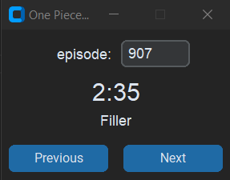

# One Piece Episode Start Times

## Description

A simple python application with gui to get episode start times so you know until when to skip each time.
Also shows if an episode is a filler and more.
Happy binging!

## Usage

Input the episode number manually, press the buttons, or use the mouse wheel to change the episode number.

## Notes

- The episode start times are based on [this reddit post](https://www.reddit.com/r/OnePiece/comments/sixbxe/one_piece_start_and_title_card_times_if_you_guys/).
- Mousewheel support may not work on linux according to [this stackoverflow post](https://stackoverflow.com/a/32289245/24978964).
